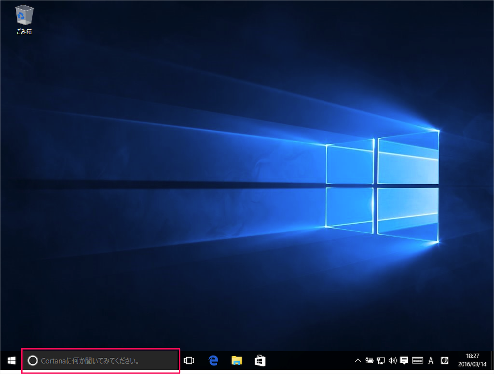
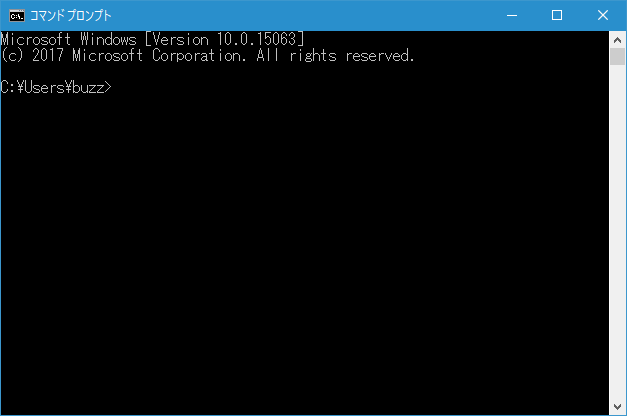
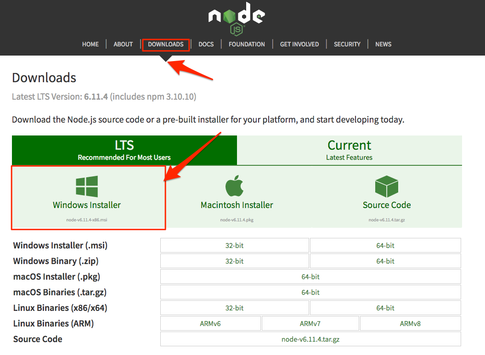
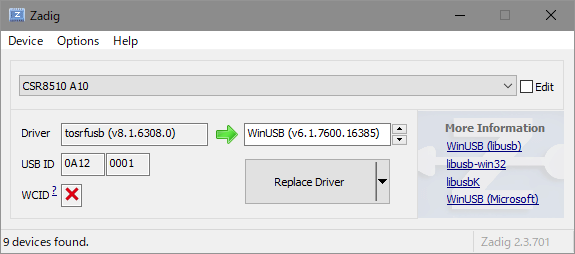
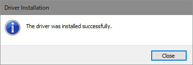

開発環境を作ろう
==================================================

これから、以下の4つのソフトウェアをインストールします。

- Node.js
- windows-build-tools モジュール
- noble モジュール
- node-rolling-spider モジュール
- temporal モジュール
- Zadig(ドライバ書き換えツール)

これらのソフトウェアを一つ一つインストールしていきましょう。

コマンドプロンプトを起動する
-------------------------------------------

タスクバーの左下にある検索フォームに「cmd」と入力してください。

コマンドプロンプトが起動します。

Node.js のインストール
-------------------------------------------

下記サイトからインストーラーをダウンロードします。

http://nodejs.org/

Download > Windows Installer をクリックするとカレントバージョンの自身のPCに合わせたインストーラーがダウンロードされます。

Node.js と npm(node package manager) がインストールされます。

"node"がインストールされているかどうかをチェックします。

下記コマンドを実行してください。

.. code-block:: none

  node --version

バージョンが表示されればインストールは成功です。

もうひとつ、 npm も同時にインストールされているはずなのでこちらもチェックします。

下記コマンドを実行してください。

.. code-block:: none

  npm --version

こちらも、バージョンが表示されればインストールは成功です。

windows-build-tools モジュールのインストール
---------------------------------------------

windows-build-tools 各種の Node モジュールを Windows ネイティブでコンパイルするための環境一式で、以下を一括でインストールできます

下記コマンドを**管理者**で実行してください

.. code-block:: none

  npm install --global windows-build-tools

.. note::

  * インストールが結構かかりますので終わるまで気長に待ってください。

noble モジュールのインストール
---------------------------------------------

 Node.JSで Bluetooth 通信ができるモジュールです。

 下記コマンドを実行してください。

 .. code-block:: none

  npm install noble

node-rolling-spider モジュールのインストール
---------------------------------------------

node-rolling-spider は ドローンをコントールするモジュールです。

下記コマンドを実行してください。

.. code-block:: none

  npm install rolling-spider

.. note::

  * 黄色い文字で「WARN」がいくつか出てくると思いますが、大丈夫です。
  * 赤い文字で「ERROR」の場合はネイティブコンパイル等に失敗しているので、エラーメッセージをもとに試行錯誤してください。

temporal モジュールのインストール
---------------------------------------------

temporal はプログラムをでシーケンシャルに実行できるモジュールです。

下記コマンドをコマンドプロンプトから実行してください。

.. code-block:: none

  npm install temporal

Bluetooth アダプタの設定
-------------------------------------------

node-rolling-spider が依存している node-bluetooth-hci-socket というモジュールを通じて使う場合は、「WinUSB」というドライバに書き換える必要があルため、Zadig というドライバ書き換えツールを使用してドライバを書き換えます。

下記サイトからZadigをダウンロードします。

http://zadig.akeo.ie

ダウンロードが完了したら、zadig-2.3.exe をダブルクリックで実行します。

Options メニュー -> List All Devices を選択するとデバイスの一覧が出ます。

デバイスの一覧から Bluetooth アダプタ（今回の場合は「CSR8510 A10」）を選ぶと、左側に現在のドライバが出ます。

これを「WinUSB」に書き換えるため、「Replace Driver」をクリックします。

「The driver was installed successfully.」と出れば成功です。
