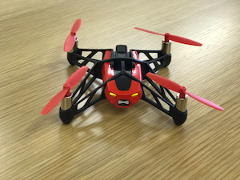

ドローンを飛ばしてみよう
==================================================

いよいよ、ドローン飛ばします。ドローンの電源を入れてください。

電源ボタンを押すとライト色が、赤 → 橙 → 緑　と変わっていきます。ライトが緑色になったら操作可能な状態です。

ドローンのUUIDを調べよう
-------------------------------------------

findDrone.js　実行してみましょう。

下記コマンドを実行してください。

.. code-block:: none

  node findDrone.js

.. code-block:: none
 :emphasize-lines: 8

  25:undefined(34942f51a49d43b1adac6e029ba2eb58) RSSI-74
  26:undefined(1787e42be209403ba2fde5821d356650) RSSI-78
  27:undefined(f34124eb29744001b0994c9b8521fb29) RSSI-70
  28:undefined(d1ed53c48f374c83b57e9c64369f94a6) RSSI-84
  29:Alta HR(1577e5a201c4458fbeccea0b338902d2) RSSI-64
  30:undefined(133c66539db043b6a1c344f060d60103) RSSI-71
  31:undefined(678774b28d2f4e528c75e17a067759f2) RSSI-72
  32:Mambo_640552(bcddd2d5f9bb47e7be84ed2e4b3b9361) RSSI-35
  33:undefined(514f76a1d8e44e46aedd496ca41bfc5c) RSSI-76
  34:undefined(7561ff0ec3fd4f7c9d97cd6eff6085b4) RSSI-59
  35:undefined(aceb1517cf154ca58cca09e9347dc201) RSSI-77
  36:undefined(9c5d9f0e827540bbb30cfa6e799c5b0a) RSSI-72

名前が”Mambo_***********”がドローンの名前になります。

カッコ内に書かれている UUID をコピーしてください。

見つかったら、control + c で処理をストップさせてください。

ドローンを操作してみよう
-------------------------------------------

先ほどのUUIDを使い、controller.js のxxxxxxxxxxxxとなっている部分を書き換えましょう。

書き換えたら、下記コマンドを実行してください。

.. code-block:: none

  node controller.js

こうなったら成功です。PCとDroneがBluetoothで接続されました。

.. code-block:: none

  Connected to drone => XXXXXX

あとはキーボードで以下のアサインされているキーを押せば操作できます。

  操縦方法（キーアサイン)

  =====  ============= ===============
  キー    動作           メソッド
  =====  ============= ===============
  t      離陸           d.takeOff()
  w      前進           d.forward({ steps: 1〜100 })
  s      後退           d.backward({ steps: 1〜100 })
  a      左水平移動      d.tiltLeft({ steps: 1〜100 })
  d      右水平移動      d.tiltRight({ steps: 1〜100 })
  ↑      上昇           d.up({ steps: 1〜100 })
  ↓      下降           d.down({ steps: 1〜100 })
  ←      左旋回         d.turnLeft({ steps: 1〜100 })
  →      右旋回         d.turnRight({ steps: 1〜100 })
  i      前方宙返り      d.frontFlip({ steps: 1〜100 })
  k      後方宙返り      d.backFlip({ steps: 1〜100 })
  j      左に宙返り      d.leftFlip({ steps: 1〜100 })
  l      右に宙返り      d.rightFlip({ steps: 1〜100 })
  q      着陸           d.land()
  x      接続解除        d.disconnect()
  m      緊急停止        d.emergency()
  =====  ============= ===============

.. warning::

  **宙返りは行う場合は、ドローンからアクセサリーを外してください！**
