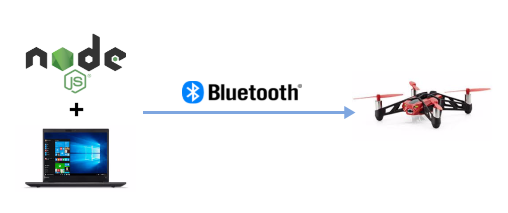

.. -*- coding: utf-8; -*-

=======================================================
OPST インターン ドローン ハンズオン
=======================================================

Auhtor: `Kokichi Saito`

概要
====

"Node.js" を使用し、"Blutoothe" 経由で ミニドローンをパソコンから操作するところまでを解説します

.. toctree::
   :hidden:
   :maxdepth: 2
   :numbered:

   00
   01
   02
   03
   04
   05

時間配分
~~~~~~~~

#. [10m] 冒頭説明
#. [30m] Droneの開発環境を作ろう
#. [30m] Node.jsプログラムを書いてみよう
#. [20m] ドローンを飛ばしてみよう
#. [20m] 自動操縦でドローンを飛ばしてみよう
#. [40m] お題を元にドローンを飛ばしてみよう
#. [10m] 片付け

※冒頭説明から片付けで約120分のコンテンツです
